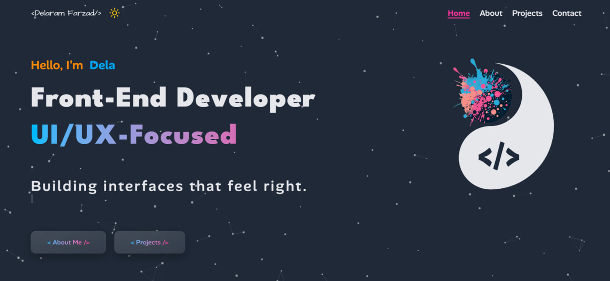

# Dela Codes — Developer Portfolio

A responsive developer portfolio built with **Next.js, React and Tailwind CSS** to showcase my front-end projects, skills and background.

🔗 **Live Demo:** https://dela-codes.vercel.app/

## Preview



## Features

* Responsive design across different screen sizes
* Reusable React components
* Multi-page structure using the Next.js Pages Router
* Dark and light theme
* Animations and transitions with Framer Motion
* Particle effects with tsParticles
* Typed text effects with Typed.js
* Project showcase and contact page

## Tech Stack

**Next.js · React · JavaScript · Tailwind CSS · Framer Motion · tsParticles · Typed.js**

## Run Locally

```bash
git clone https://github.com/delaramfarzad9/YOUR-REPO-NAME.git
cd YOUR-REPO-NAME
npm install
npm run dev
```

Then open `http://localhost:3000` in your browser.

## Author

**Delaram Farzad** — Front-End Developer

[Portfolio](https://dela-codes.vercel.app/) ·  [LinkedIn](https://www.linkedin.com/in/delaram-farzad)
